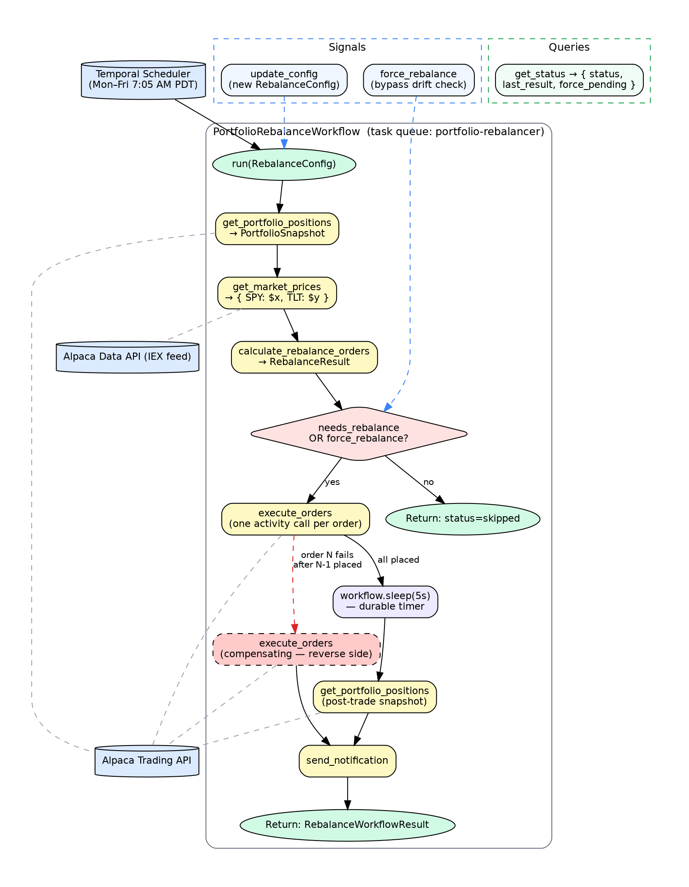
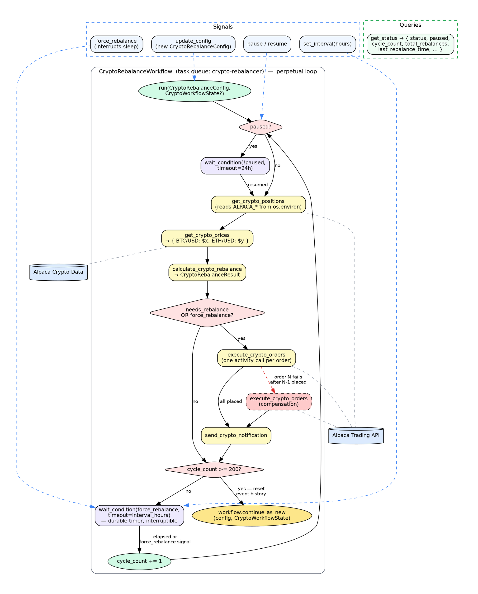

# Portfolio Rebalancer — Temporal.io + Alpaca

Two portfolio rebalancing workflows built on Temporal.io, both targeting a 60/40 allocation using the Alpaca brokerage API.

| Workflow | Assets | Execution model | Entry points |
|----------|--------|-----------------|--------------|
| SPY/TLT  | SPY + TLT | Single run, schedule-triggered | `portfolio_worker.py` / `portfolio_trigger.py` |
| Crypto   | BTC/USD + ETH/USD | Perpetual loop (`continue_as_new`) | `crypto_worker.py` / `crypto_trigger.py` |

---

## Workflow Diagrams

### SPY/TLT — `PortfolioRebalanceWorkflow`



### Crypto — `CryptoRebalanceWorkflow` (perpetual)



> Render with `dot -Tsvg <file.dot> -o diagram.svg` (Graphviz), or paste into
> [Graphviz Online](https://dreampuf.github.io/GraphvizOnline/).

---

## Setup

**Prerequisites:** Python 3.12+, an [Alpaca paper trading account](https://alpaca.markets), and a running Temporal server (`brew install temporal && temporal server start-dev` — UI at http://localhost:8080).

```bash
python -m venv .venv && source .venv/bin/activate
pip install -r requirements.txt
```

**Required environment variables:**
```bash
export ALPACA_API_KEY=<your key>
export ALPACA_SECRET_KEY=<your secret>
export ALPACA_BASE_URL=https://paper-api.alpaca.markets
```

---

## Running

### Workers

```bash
# SPY/TLT worker (local Temporal only)
python portfolio_worker.py

# Crypto worker (local or Temporal Cloud via mTLS)
python crypto_worker.py
```

`TEMPORAL_HOST` defaults to `localhost:7233`; `TEMPORAL_NAMESPACE` defaults to `default`.

For Temporal Cloud, set `TEMPORAL_TLS_CERT` and `TEMPORAL_TLS_KEY` before starting `crypto_worker.py`.

### Docker

```bash
docker-compose up                   # both workers (local Temporal)
docker-compose up crypto-worker     # crypto worker only
docker-compose --profile cloud up   # both workers against Temporal Cloud
```

Cloud profile additionally requires `TEMPORAL_CLOUD_HOST`, `TEMPORAL_CLOUD_NAMESPACE`, and a cert directory at `TEMPORAL_CERT_DIR` (containing `client.pem` + `client.key`).

---

## Client Commands

### SPY/TLT (`portfolio_trigger.py`)

```bash
python portfolio_trigger.py dry-run        # calculate orders but do not place them
python portfolio_trigger.py start          # single live run
python portfolio_trigger.py schedule         # create Temporal Schedule (Mon–Fri 7:05 AM PDT)
python portfolio_trigger.py delete-schedule  # delete the existing schedule
python portfolio_trigger.py signal-force     # send force_rebalance signal to running workflow
python portfolio_trigger.py query-status     # query get_status
```

### Crypto (`crypto_trigger.py`)

```bash
python crypto_trigger.py start              # start perpetual workflow
python crypto_trigger.py dry-run            # start in dry-run mode
python crypto_trigger.py force              # signal: rebalance now (skip sleep)
python crypto_trigger.py pause              # signal: pause cycling
python crypto_trigger.py resume             # signal: resume cycling
python crypto_trigger.py set-interval 1.5   # signal: change interval to 1.5 h
python crypto_trigger.py status             # query get_status
python crypto_trigger.py stop               # terminate workflow
```

---

## Rebalancing Logic

Both workflows share the same threshold-based logic, applied to their respective asset pairs:

```
target_a = target_a_pct × portfolio_value
target_b = target_b_pct × portfolio_value

drift_a = |current_a_weight - target_a_pct|
drift_b = |current_b_weight - target_b_pct|

if drift_a > drift_threshold OR drift_b > drift_threshold:
    order_a_notional = target_a - current_a_value   # positive = buy, negative = sell
    order_b_notional = target_b - current_b_value
    → place notional market orders for both symbols
```

Default config: 60% equity/BTC, 40% bond/ETH, 5% drift threshold.

Orders smaller than $1 notional are skipped (sub-dollar rounding noise).

### Saga / Compensation

Orders are placed sequentially (one activity per order). If order N fails after orders 0…N-1 have already been accepted, the workflow immediately places compensating orders (same symbol, reversed side) for all previously placed orders. If compensation also fails, the workflow logs `MANUAL INTERVENTION REQUIRED` and continues.

### Idempotency

`execute_orders` derives a deterministic `client_order_id` from a hash of the order parameters. Alpaca returns HTTP 422 for duplicate IDs; the activity treats this as "already placed" so Temporal retries are safe.

---

## Credentials and Temporal History

All activities read `ALPACA_API_KEY` and `ALPACA_SECRET_KEY` directly from `os.environ` — credentials are never passed through workflow arguments or stored in Temporal's event history.

For local development, set them as plain environment variables. On Temporal Cloud, inject them as environment variables via Cloud's secret management so workers pick them up at runtime without the values ever touching workflow state.

---

## Task Queues and Workflow IDs

| | SPY/TLT | Crypto |
|---|---|---|
| Task queue | `portfolio-rebalancer` | `crypto-rebalancer` |
| Workflow ID (single run) | `portfolio-rebalancer-main-live` | `crypto-rebalancer-perpetual` |
| Schedule ID | `portfolio-rebalancer-daily` | — |
